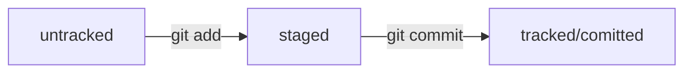

# Шапаргалка
## Навигация в Git

- **pwd** (от англ. print working directory, «показать рабочую папку») — покажи, в какой я папке;

- **ls** (от англ. list directory contents, «отобразить содержимое директории») — покажи файлы и папки в текущей папке;

- **ls -a** — покажи также скрытые файлы и папки, названия которых начинаются с символа .;

- **cd first-project** (от англ. change directory, «сменить директорию») — перейди в папку first-project;

- **cd first-project/html** — перейди в папку html, которая находится в папке first-project;

- **cd ..** — перейти на уровень выше, в родительскую папку;

- cd ~ — перейти в домашнюю директорию (/Users/Username);

- **cd /** — перейдти в корневую директорию.

## Хеширование

**Хеширование** (от англ. hash, «рубить», «крошить», «мешанина») — это способ преобразовать набор данных и получить их «отпечаток» (англ. fingerprint).

## Файл HEAD

Файл **HEAD** (англ. «голова», «головной») — один из служебных файлов папки .git. Он указывает на коммит, который сделан последним (то есть на самый новый).

Внутри HEAD — ссылка на служебный файл: *refs/heads/master*

Когда вы делаете коммит, Git обновляет refs/heads/master — записывает в него хеш последнего коммита. Получается, что HEAD тоже обновляется, так как ссылается на refs/heads/master

## Статусы файлов

Бывают **untracked/tracked**, **staged** и **modified** файлы

- **untracked** (англ. «неотслеживаемый»)  
Новые файлы в Git-репозитории помечаются как untracked, то есть неотслеживаемые. У untracked-файла нет предыдущих версий, зафиксированных в коммитах или через команду git add.

- **staged** (англ. «подготовленный»)  
  После выполнения команды git add файл попадает в staging area (от англ. stage — «сцена», «этап [процесса]» и area — «область»), то есть в список файлов, которые войдут в коммит. В этот момент файл находится в состоянии staged.

- **tracked** (англ. «отслеживаемый»)  
Состояние tracked — это противоположность untracked. Все файлы, в которых Git так или иначе отслеживает изменения.

- **modified** (англ. «изменённый»)  
Состояние modified означает, что Git сравнил содержимое файла с последней сохранённой версией и нашёл отличия. Например, файл был закоммичен и после этого изменён.

